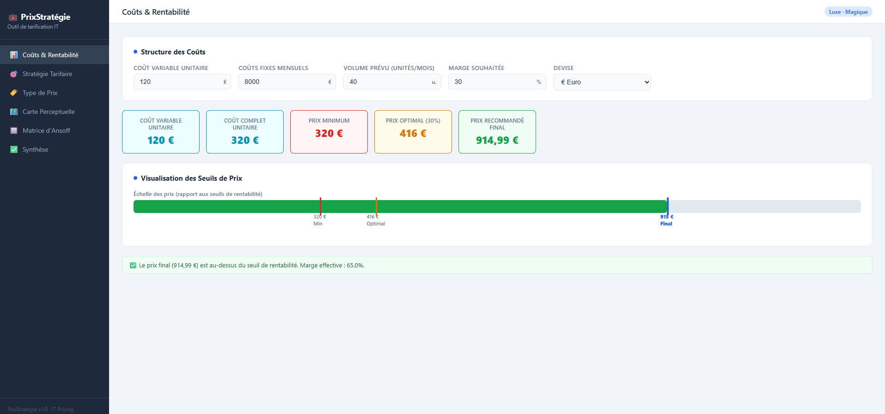
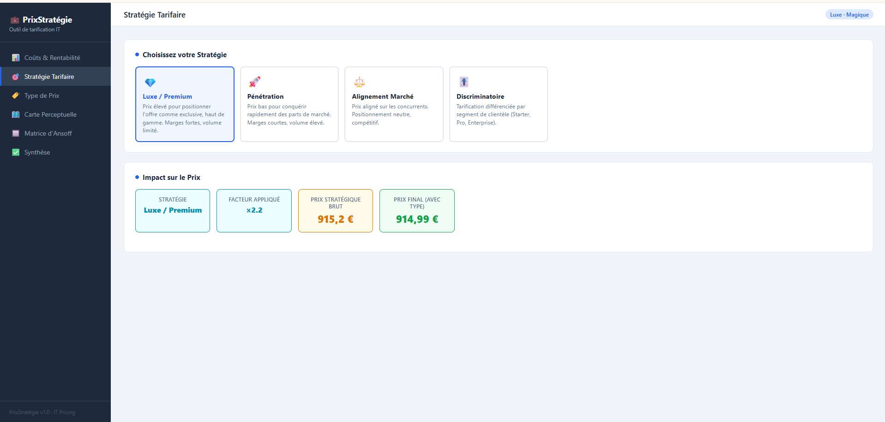
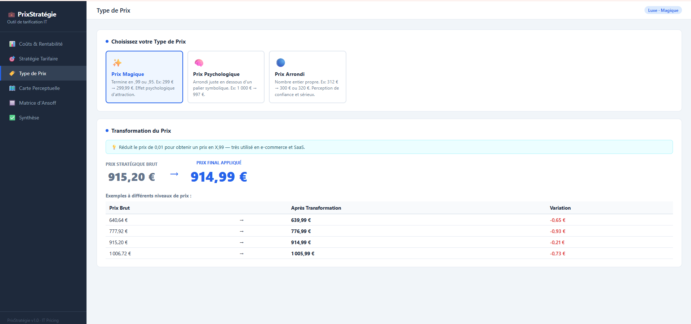
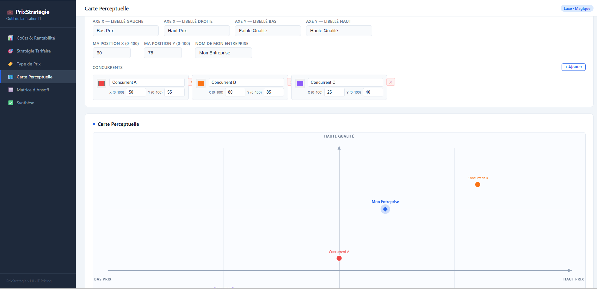
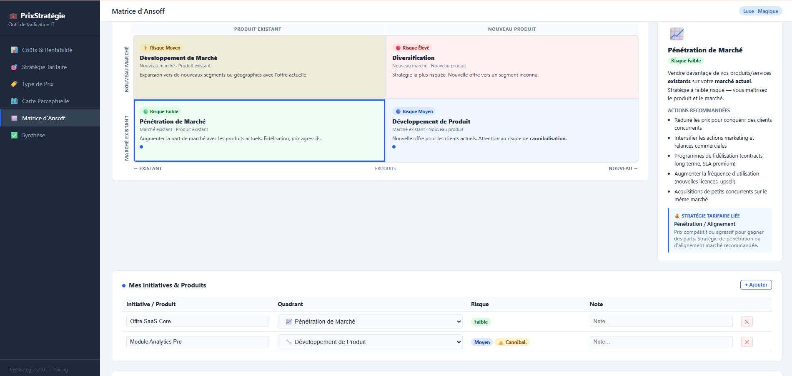
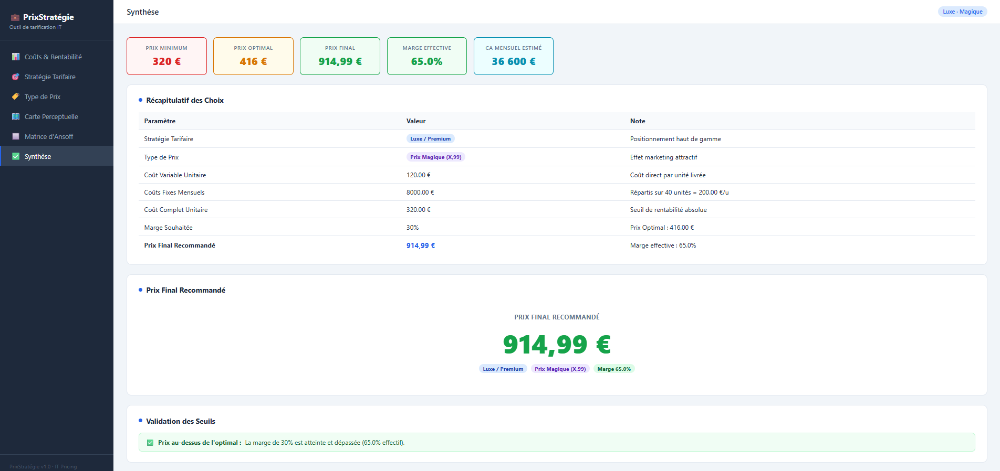

# PrixStratégie

Outil web d'aide à la décision tarifaire pour une entreprise IT. Entièrement en HTML/CSS/JS vanilla — aucune dépendance, aucun build.

---

## Démo rapide (mode standalone)

1. Ouvrir **`index.html`** directement dans un navigateur (double-clic ou *File → Open* dans Chrome/Firefox/Edge).
2. Aucun serveur requis. Tout le CSS, JS et HTML est embarqué dans ce seul fichier.

---

## Mode développement (fichiers modulaires)

Les sources sont découpées en modules pour faciliter l'édition :

```
prix-strategie/
├── index.html              ← démo standalone (tout-en-un)
├── css/
│   └── styles.css          ← toutes les variables et règles CSS
├── js/
│   ├── state.js            ← état global de l'application
│   ├── utils.js            ← calculs de prix et utilitaires
│   ├── main.js             ← navigation, init, chargement des partials
│   └── pages/
│       ├── costs.js        ← page Coûts & Rentabilité
│       ├── strategy.js     ← page Stratégie Tarifaire
│       ├── pricetype.js    ← page Type de Prix
│       ├── positioning.js  ← page Carte Perceptuelle
│       ├── ansoff.js       ← page Matrice d'Ansoff
│       └── synthesis.js    ← page Synthèse
└── partials/
    ├── page-costs.html
    ├── page-strategy.html
    ├── page-pricetype.html
    ├── page-positioning.html
    ├── page-ansoff.html
    └── page-synthesis.html
```

> **Note :** Le chargement des partials utilise `fetch()`, qui est bloqué sur le protocole `file://`. Un serveur HTTP local est nécessaire pour cette version.

### Lancer via IntelliJ IDEA

1. Faire un clic droit sur **`index.html`** dans l'arborescence du projet.
2. Choisir **Open In → Browser → (votre navigateur)** — IntelliJ démarre son serveur intégré automatiquement.
3. L'URL ressemble à `http://localhost:63342/prix-strategie/index.html`.

### Prévisualiser une page isolée

Chaque fichier `partials/page-*.html` est un document HTML complet avec lien vers `css/styles.css`. Ouvrez-le directement dans le navigateur via IntelliJ pour prévisualiser la page avec ses styles.

---

## Pages de l'application

| Page | Description |
|------|-------------|
| **Coûts & Rentabilité** | Saisie des coûts variables, fixes, volume et marge cible. Calcul du prix de revient, optimal et minimum. |
| **Stratégie Tarifaire** | Choix entre Luxe, Pénétration, Alignement marché et Discriminatoire (segments de clientèle). |
| **Type de Prix** | Application d'un arrondi Magique (ex. 99,99 €), Psychologique (seuil symbolique) ou Arrondi. |
| **Carte Perceptuelle** | Positionnement visuel sur deux axes personnalisables face aux concurrents (canvas interactif). |
| **Matrice d'Ansoff** | Classement des initiatives par quadrant (Pénétration, Développement marché/produit, Diversification). |
| **Synthèse** | Récapitulatif complet : KPIs, choix stratégiques, prix final recommandé et validation des seuils. |

---

### Coûts & Rentabilité

Saisie des coûts variables, fixes, du volume et de la marge cible. L'outil calcule automatiquement le prix de revient, le prix optimal et le prix minimum de rentabilité, avec une barre de visualisation et des alertes si le prix choisi est en dessous des seuils critiques.



---

### Stratégie Tarifaire

Sélection de la stratégie de prix parmi quatre options : **Luxe** (positionnement premium), **Pénétration** (prix bas pour conquérir des parts de marché), **Alignement marché** (calage sur la concurrence) et **Discriminatoire** (segments de clientèle avec multiplicateurs personnalisés).



---

### Type de Prix

Transformation du prix brut selon trois approches psychologiques : **Magique** (ex. 99,99 €), **Psychologique** (en dessous d'un seuil symbolique) ou **Arrondi** (présentation claire). Un tableau compare les variantes pour chaque type.



---

### Carte Perceptuelle

Canvas interactif à deux axes entièrement personnalisables (ex. Bas Prix ↔ Haut Prix, Faible Qualité ↔ Haute Qualité). Permet de positionner son entreprise et ses concurrents visuellement pour identifier les zones de différenciation ou de sur-concurrence.



---

### Matrice d'Ansoff

Grille Marchés × Produits en 2×2 pour classer les initiatives stratégiques par niveau de risque : **Pénétration de marché** (faible risque), **Développement de marché**, **Développement de produit** (attention à la cannibalisation) et **Diversification** (risque élevé). Chaque quadrant dispose d'un suivi d'initiatives et d'une analyse des risques tarifaires.



---

### Synthèse

Vue consolidée de toutes les décisions : KPIs financiers, tableau récapitulatif des choix stratégiques, prix final recommandé et validation par rapport aux seuils de rentabilité.



---

**Développé avec ❤️ par l'équipe PRF IT Solutions**

*Cet outil est conçu pour aider les petites PME à définir leur stratégie de prix pour leurs produits.*